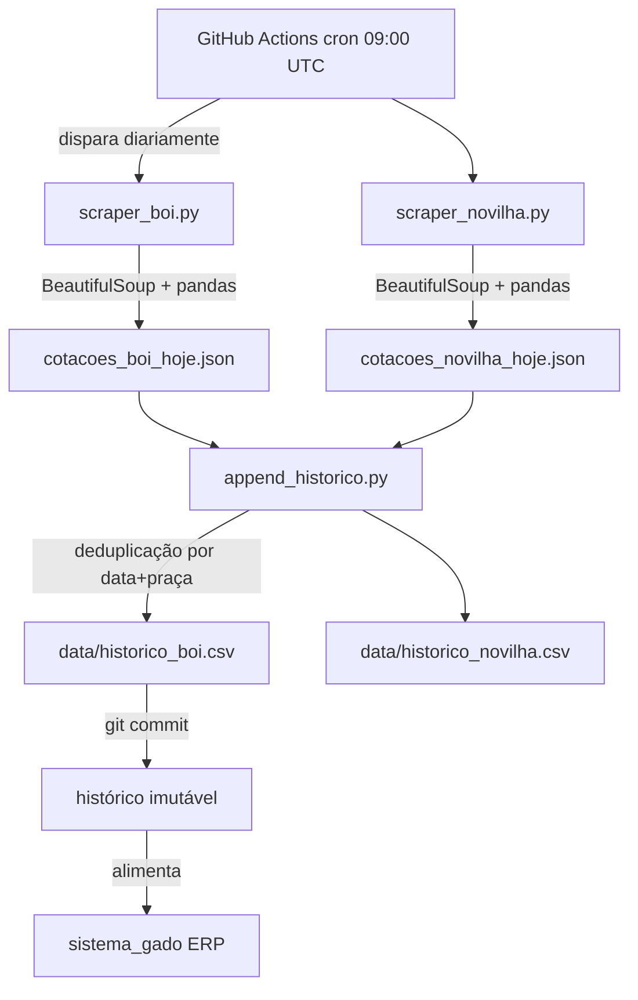

# 🚜 Gado-Scraper

[](https://python.org)
[](https://github.com/features/actions)
[](https://github.com/Dom1ng0s/Gado-Scraper)

[](LICENSE)

Não existe API pública para cotações de boi gordo no Brasil. As 33 praças estão espalhadas em páginas HTML de difícil acesso que mudam layout com frequência. O Gado-Scraper coleta essas cotações diariamente via GitHub Actions e as armazena como commits no próprio repositório, alimentando o [Sistema de Gestão de Gado](https://sistemadogado.up.railway.app).

## Por que Git como banco de dados

Cada execução gera um commit com os JSONs do dia. Isso cobre três coisas que um banco convencional exigiria configurar separadamente: o histórico é imutável por definição (`git show <hash>:cotacoes_boi_hoje.json` recupera qualquer dia), o custo de infraestrutura é zero, e qualquer fork herda o histórico completo sem migração.

O `build_dataset.py` percorre todos os commits e reconstrói o CSV acumulativo se necessário. Não é necessário parsear o git manualmente para análise rotineira, porque `data/historico_boi.csv` já consolida tudo.

## Output real (execução de 2026-06-26)

```
Acessando o site... (tentativa 1/3)
Tabela encontrada! Dimensões brutas: (44, 12)
Sucesso Total! 33 linhas salvas em 'cotacoes_boi_hoje.json'.
```

Amostra dos dados coletados:

```json
{"praca": "SP Barretos",   "preco_vista": 338.5, "preco_30d": "342.00", "variacao": "0.00",  "data_coleta": "2026-06-26"}
{"praca": "SP Araçatuba",  "preco_vista": 338.5, "preco_30d": "342.00", "variacao": "0.00",  "data_coleta": "2026-06-26"}
{"praca": "MG Triângulo",  "preco_vista": 316.5, "preco_30d": "320.00", "variacao": "-6.39", "data_coleta": "2026-06-26"}
```

## Histórico acumulado

171 snapshots desde 27/12/2025 (181 dias de operação). O arquivo `data/historico_boi.csv` tem 5.115 linhas, uma por praça por dia de coleta.

## Arquitetura do pipeline



## Lógica de scraping

O ponto frágil de qualquer scraper é a âncora no HTML. Aqui a âncora é a string `"Funrural"`, que aparece como coluna na tabela de preços e é estável há mais de um ano. Se o scraping quebrar, esse é o primeiro lugar a verificar.

As colunas são selecionadas por posição (`COLUNAS_IDX`), não por nome, porque o header da tabela muda com o layout. O `pd.read_html()` lida com o MultiIndex via dois `droplevel(0)` consecutivos.

O retry automático tenta até 3 vezes com backoff de 5 segundos entre tentativas. Erros persistentes disparam uma notificação no Telegram com link direto para o log do Actions.

## Como rodar localmente

```bash
git clone https://github.com/Dom1ng0s/Gado-Scraper.git
cd Gado-Scraper
pip install -r requirements.txt

python scraper_boi.py       # gera cotacoes_boi_hoje.json
python scraper_novilha.py   # gera cotacoes_novilha_hoje.json
python append_historico.py  # atualiza os CSVs acumulativos
```

Para consultar cotações de um dia específico via git:

```bash
git log --oneline                                        # cada linha = um dia
git show <commit-hash>:cotacoes_boi_hoje.json            # cotações daquele dia
```

## Licença

MIT
