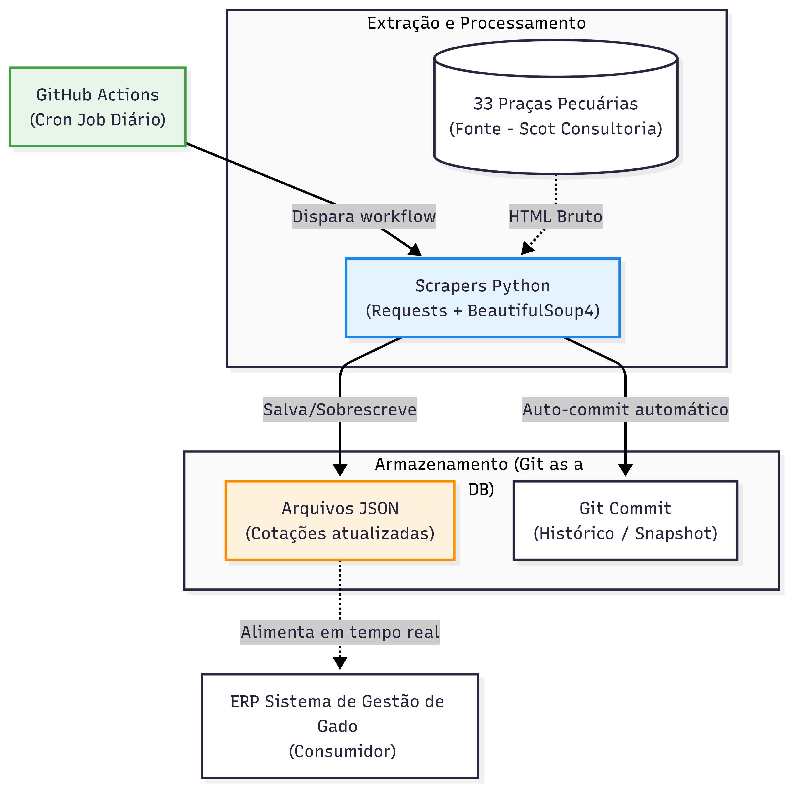

### 🚜 Gado-Scraper

**Pipeline automatizada para monitoramento diário de cotações pecuárias**

Pipeline de dados que coleta e agrega automaticamente as cotações de boi gordo e novilha de **33 praças pecuárias do Brasil** todos os dias. O sistema roda 100% na nuvem via GitHub Actions — sem servidores, sem custos de infraestrutura e sem intervenção manual.

---

#### 💡 O Problema que Este Projeto Resolve

Pecuaristas tomam decisões de compra e venda baseadas nas cotações do dia, mas essas informações estão espalhadas em dezenas de sites de difícil acesso e não existem APIs públicas confiáveis para o setor agropecuário.

O Gado-Scraper resolve isso com uma arquitetura engenhosa e de custo zero:
*   **GitHub Actions como Cron Job:** Um workflow automatizado dispara o scraper todos os dias no horário de fechamento do mercado.
*   **Git como Banco de Dados Histórico:** O próprio repositório funciona como armazenamento — cada commit diário é um snapshot de dados pronto para análise de séries temporais.
*   **Integração Direta:** Os dados gerados alimentam em tempo real o ERP (Sistema de Gestão de Gado).

---

#### 🏗️ Arquitetura do Pipeline (ETL)

---

#### 📊 Formato dos Dados Coletados

Os scrapers exportam os dados em arquivos JSON estruturados na raiz do repositório, prontos para consumo imediato por qualquer sistema, frontend ou API:

*   `cotacoes_boi_hoje.json`
*   `cotacoes_novilha_hoje.json`

💾 **Nota:** O histórico completo de preços está preservado no `git log`. 

---

#### ⚙ Como a Pipeline Funciona

O arquivo localizado em `.github/workflows/atualizacao_diaria.yml` contém o workflow com uma *cron expression*, que aciona os scripts `scraper_boi.py` e `scraper_novilha.py`. Eles fazem a extração via web scraping, processam os valores e realizam o *auto-commit* dos arquivos JSON atualizados.

---

#### 🛠 Stack Tecnológica

| Responsabilidade | Tecnologia |
| ------ | ------ |
| **Linguagem** | Python 3.10+ |
| **Scraping** | Requests + BeautifulSoup4 |
| **Automação / CI** | GitHub Actions (Cron) |
| **Armazenamento** | JSON persistido no repositório |
| **Versionamento histórico** | Git (commits diários automáticos) |

---

#### 🔧 Como Fazer o Fork e Usar na Sua Conta

A pipeline é 100% autossuficiente e roda automaticamente em qualquer *fork*. Nenhuma configuração extra (como variáveis de ambiente ou tokens de API) é necessária.

1. Faça o fork deste repositório.
2. Vá na aba **Settings → Actions → General** do seu fork e dê as permissões de leitura e escrita para os workflows (`Read and write permissions`).
3. O GitHub Actions passará a rodar o scraper automaticamente na sua conta todos os dias.

*(Para rodar localmente, basta instalar as dependências com `pip install -r requirements.txt` e executar os scripts `.py`)*

---

#### 🗺 Roadmap (Próximas Evoluções)

- [x] Integração direta com o `sistema_gado` para alimentar cotações em tempo real
- [ ] Dashboard com histórico de variações de preço (Streamlit ou Grafana)
- [ ] Exportação automatizada para CSV visando análise em Pandas/Excel
- [ ] Notificação via Telegram quando o preço em uma praça chave ultrapassar um threshold configurável

---

#### 👤 Autor
**Davi Domingos de Oliveira**  
Estudante de Ciência da Computação — UFAL | Backend Developer
